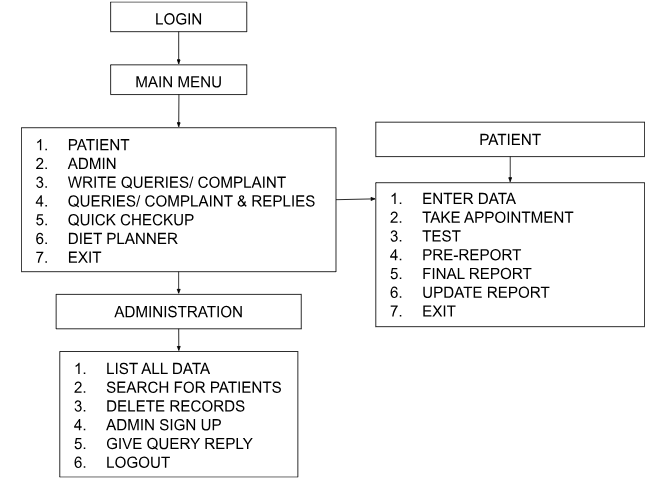

# 🩺 Personalised Diabetes Checkup

A C++ based personalized diabetes checkup and management system developed as a mini-project in **Semester II**. This program offers patient and admin logins, diabetes risk detection, appointment booking, report generation, and other helpful tools aimed at early detection and management of diabetes.

---

## 👥 Team Members

| Name           | Enrolment Number |
|----------------|------------------|
| Nikita Gupta   | 23103288         |
| Khushi Rathore | 23103283         |
| Akshita Jain   | 23103277         |
| Eshna Jain     | 23103304         |

---

## 🧠 Project Overview

This C++ project simulates a personalized diabetes checkup system. It enables patients to log in, take diabetes-related tests, book appointments, and receive risk assessments and diet suggestions. The admin can manage appointments, records, and respond to patient queries. The system is file-based and built using core C++ principles such as OOP, file handling, and dynamic memory allocation.

---

## ✅ Features

- 👤 **Patient Login**
  - Book Appointment
  - Take Quick Test
  - View Report
  - Receive Medicine Suggestions
  - Diet Planner

- 🛠️ **Admin Panel**
  - View All Patients
  - Search/Delete Records
  - Respond to Queries

- 📨 **Query Section**
  - Patients can submit questions
  - Admin replies with answers

- 📂 **File Handling**
  - Save and retrieve patient records and reports

---

## 💡 Requirements

This program analyzes input data like:
- Blood sugar levels
- Insulin levels
- Age
- BMI
- Medical history indicators

It then applies logic to assess the probability of diabetes and recommends actions or medications accordingly.

---

## 🎯 Purpose

To help in **early detection**, **risk assessment**, and **management** of diabetes using simple, efficient, and interactive C++ tools. The program also serves as an **educational platform** to raise awareness among users about diabetes management.

---

## 🛠️ Technologies Used

- **Language**: C++
- **Paradigm**: Object-Oriented Programming
- **Key Concepts**:
  - Classes & Objects
  - Constructors & Friend Functions
  - Arrays and Strings
  - File Handling
  - Pointers and Dynamic Memory Allocation (DMA)

---

## 🔁 UML / Flowchart

---

## 🧪 How It Works

1. **Login Screen**: Patient or Admin selection
2. **Patient Portal**:
   - Book appointments
   - Submit health parameters
   - Get risk reports and suggestions
3. **Admin Portal**:
   - View and manage patient records
   - Answer queries
4. **Checkup Module**:
   - Quick test and score analysis
   - Medicine recommendations
   - Report generation

---

## ▶️ How to Run

1. Clone the repository

2. Compile the code

3. Login Credentials:

   Userid: 1234  
   Password: 1234

## 📌 License

This project is developed as part of a university academic curriculum and is intended for educational purposes only.

